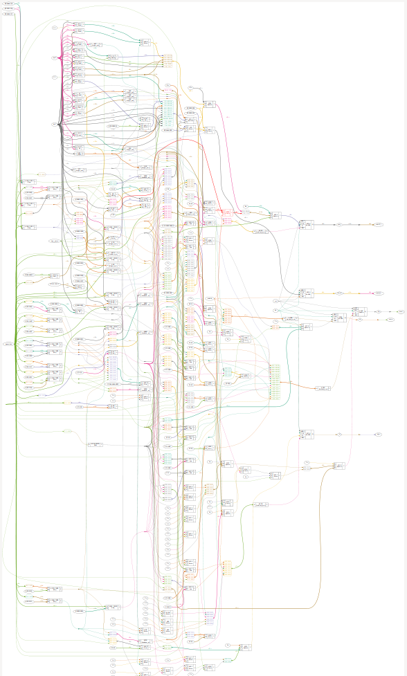
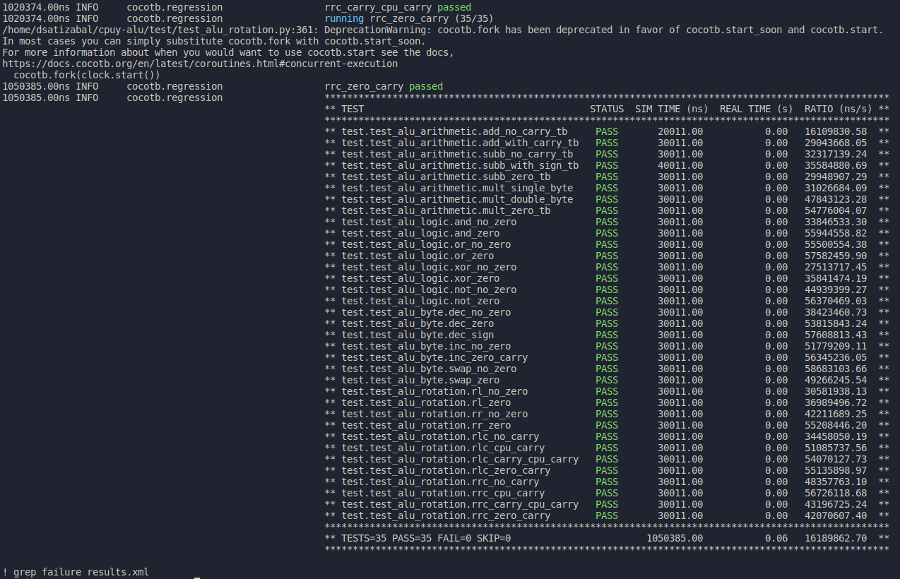
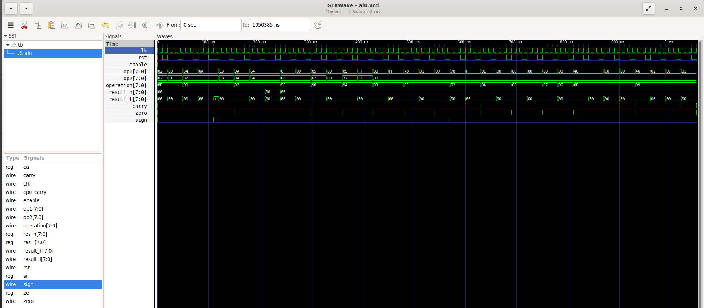

# Simple ALU

Implements an ALU that can be used for a CPU implementation, intended to be used in a simple 8-bits CPU to be sent for Tapeout in the [Dec 2023 Efabless shuttle](https://efabless.com/gf-180-open-mpw-shuttle-program)

## Inputs and Outputs description:

- **rst**: reset signal
- **enable**: enables ALU for operation
- **operation**: indicates the operation (see list below)
- **op1**: operand 1
- **op2**: operand 2
- **cpu_carry**: current value of carry held by CPU
- **result_l**: lower byte of result
- **result_h**: upper byte of result (used only for Multiplication result)
- **carry**: resulting carry flag
- **zero**: resulting zero flag
- **sign**: resulting sign flag

## Supported Operations:

Two operands operations:
- **Add**: Adds Op1 + Op2
- **Sub**: Subs Op1 - Op2
- **Mult**: Multiplies Op1 * Op2
- **And**: Logical AND Op1 AND Op2
- **Or**: Logical OR Op1 OR Op2
- **Xor**: Logical XOR Op1 XOR Op2

Single operand operations:
- **Dec**: Decrements by 1 Op1
- **Inc**: Increments by 1 Op1
- **Not**: Logical NOT over Op1
- **RL**: Rotates Op1 in a loop to the left
- **RR**: Rotates Op1 in a loop to the right
- **RLC**: Rotates Op1 through carry to the left
- **RRC**: Rotates Op1 through carry to the righ
- **Swap**: Swaps nibbles of Op1
- **Setb N**: Sets bit N of Work register to 1
- **Clrb N**: Clears bit N of Work register to 0

## Operation:

This ALU is implemented as a combinational logic circuit so no clock is required.

If the *rst* signal is driven high the ALU is resetted in a way that the result (*result_l* and *result_h* registers) are set to zero, also the threee flags: *carry, zero, sign* are set to low.

If the *enable* signal is set to low the ALU won't perform any operation other than reset, so it can be somehow considered as isolated from the external system.

The operation input byte is meant to contain the complete Opcode of the instruction as stored in the ROM, no preprocessing is required.

The result is normally outputted in the *result_l* register, for the case of Multiplication, where the result can span more than 8 bits, the upper byte of the result is placed in the *result_h* register.

The carry flag is set to high if the result of a Sum or Inc operation exeedes the 8 bits, similarly, the sign flag is set to high if the result of an operation is negative, however, the value written to the *result_l* register is unsigned and rather contains the absolute value of the result, for example, if *Op1* is 0 and a Dec operation is performed, the *result_l* will contain 1 and the sign flag will be activated.

Every operation resulting in a zero will activate the zero flag.

## Synthetizing with YoSys:

Run:

```
make synth_alu
```

and you should see a YoSys window opening showing the synthesis like this (kind of complex this one :S):



observe this synth does not use standard cells.

## Running CocoTB tests:

Type the following command to run tests:

```
make test_alu
```

you should see a result like this:



Observe in the Makefile that a dump_stack.v file is included and used to run the test command, in that file, the output file and the variables to be dumped (the name of the top module) are defined, after running the test the corresponding .vcd (value change dump) file is created and you can proceed to view it with the GtkWave command:

```
make gtkwave_alu
```

a GtkWave window will open, you should see the hierarchy of the TestBechn and ALU containing the available signals that can be displayed for examination, like in our case we're viewing the clk, rst, enable, operation, data_in, data_out, empty and full:



observe that for tests we're using a verilog testbench defined in the tb.v file (Design Under Test or DUT for CocoTB) that instantiates the ALU module and assings the corresponding signals.

## Running Formal Verification:

WIP
